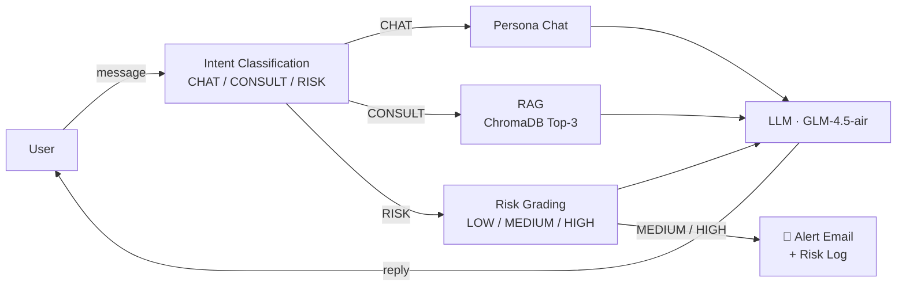

# PsycheLink 🧠

[](https://github.com/CharlsOliver-kws/Psychelink/actions/workflows/ci.yml)
[](LICENSE)
[](https://spring.io/projects/spring-boot)
[](https://openjdk.org/)

**[中文文档](README.zh-CN.md)** | English

PsycheLink is a mental-health-aware AI companion built with **Spring Boot 3 + Spring AI**. On the surface it's a friendly chat app ("肉包的聊天小站" / Rou-Bao's Chat Corner); under the hood, every message goes through intent classification, RAG retrieval over a professional psychology knowledge base (ChromaDB), and **automatic risk detection with email alerts** — a closed loop from *detection* to *intervention*.

> ⚠️ **Disclaimer**: PsycheLink is a technical demo, **not** a medical device and **not** a substitute for professional help. If you or someone you know is in crisis, please contact local emergency services or a crisis hotline immediately.

## How It Works



- **CHAT** — casual conversation with the "Rou-Bao" persona
- **CONSULT** — the query is embedded, matched against 101 professional Q&A pairs in ChromaDB, and the retrieved knowledge grounds the LLM's answer
- **RISK** — the message is graded for severity; MEDIUM/HIGH triggers an async alert email to a counselor and a risk log entry, while the user receives a carefully composed intervention response

## Features

- ✅ Three-way intent classification (CHAT / CONSULT / RISK) with keyword pre-filter + LLM classification
- ✅ RAG pipeline: embedding → ChromaDB vector search → grounded generation
- ✅ Risk grading with automated email alerts (Spring Mail + SMTP)
- ✅ Full-stack OpenTelemetry tracing — every chat produces spans (`prompt_assembly`, `rag`, `mcp_email`, ...) via OTel Java Agent
- ✅ Works with any OpenAI-compatible LLM endpoint (default: Zhipu GLM)

## Quick Start

**Prerequisites**: JDK 17, Docker.

```bash
# 1. Start ChromaDB
docker compose up -d chromadb

# 2. Configure your keys
cp .env.example .env    # fill in ZHIPU_API_KEY, MAIL_*, ALERT_RECIPIENT

# 3. Run (load env vars first, e.g. `set -a; source .env; set +a` on Linux/macOS)
./mvnw spring-boot:run
```

Open http://localhost:8088 — the app auto-imports the knowledge base on first start.

<details>
<summary>Windows (PowerShell)</summary>

```powershell
docker compose up -d chromadb
Copy-Item .env.example .env   # edit it
$env:ZHIPU_API_KEY="..."; $env:MAIL_USERNAME="..."; $env:MAIL_PASSWORD="..."; $env:ALERT_RECIPIENT="..."
.\mvnw.cmd spring-boot:run
```
</details>

## Configuration

All secrets come from environment variables (see [.env.example](.env.example)):

| Variable | Required | Description |
|---|---|---|
| `ZHIPU_API_KEY` | ✅ | API key for the LLM provider (Zhipu by default) |
| `LLM_BASE_URL` | – | Any OpenAI-compatible endpoint |
| `LLM_MODEL` | – | Default `glm-4.5-air` |
| `MAIL_USERNAME` / `MAIL_PASSWORD` | – | SMTP sender (QQ Mail auth code, not login password) |
| `ALERT_RECIPIENT` | – | Who receives risk alerts |
| `CHROMA_URL` | – | Default `http://localhost:8000` |

## Project Structure

```
src/main/java/com/psychic/agent/
├── config/          # WebClient, Security, CORS, data bootstrap
├── controller/      # REST endpoints (chat, auth)
├── service/         # ChatService (orchestration), PsychologicalService (intent/risk),
│                    # KnowledgeBaseService + EmbeddingService + ChromaService (RAG),
│                    # McpEmailService (alerts), McpExcelService (risk log)
├── entity/          # JPA entities
└── repository/      # Spring Data JPA
```

More details: [docs/architecture.md](docs/architecture.md) · Observability guide: [docs/observability.md](docs/observability.md)

## Roadmap

- [ ] SSE streaming responses
- [ ] JWT auth + role-based access control
- [ ] MCP (Model Context Protocol) tool integration
- [ ] Multi-model routing (local Ollama for sensitive processing, cloud API for general chat)

## Contributing

Issues and PRs are welcome — see [CONTRIBUTING.md](CONTRIBUTING.md).

## License

[MIT](LICENSE)
