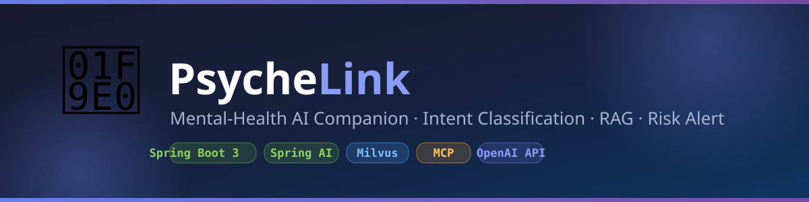
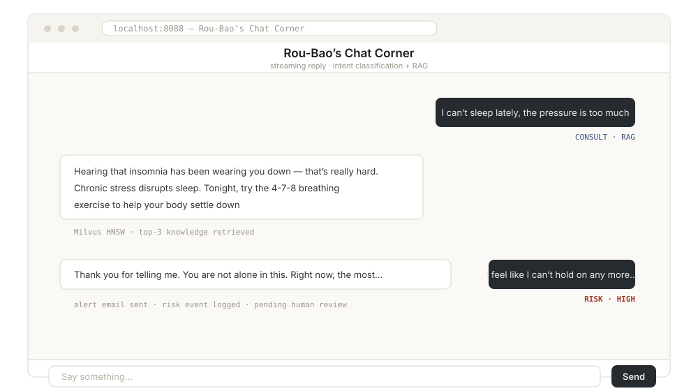
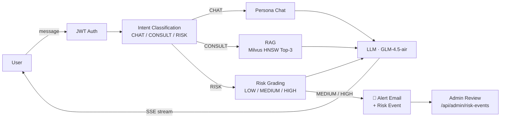

<p align="center">
  
</p>

<h1 align="center">PsycheLink</h1>

<h3 align="center">Mental-Health AI Companion<br/>
<sub>Intent Classification · RAG · Streaming Chat · Risk-Alert Closed Loop</sub></h3>

<p align="center">
  <a href="https://github.com/CharlsOliver-kws/Psychelink/actions/workflows/ci.yml"></a>
  <a href="https://github.com/CharlsOliver-kws/Psychelink/releases"></a>
  <a href="LICENSE"></a>
  
</p>

<p align="center">
  <a href="https://spring.io/projects/spring-boot"></a>
  <a href="https://spring.io/projects/spring-ai"></a>
  <a href="https://openjdk.org/"></a>
  <a href="https://milvus.io/"></a>
  <a href="https://modelcontextprotocol.io/"></a>
</p>

<p align="center">
  <b>English</b> · <a href="README.zh-CN.md">中文</a> · <a href="docs/architecture.md">Architecture</a> · <a href="docs/observability.md">Observability</a> · <a href="training/README.md">Fine-tuning</a> · <a href="https://github.com/CharlsOliver-kws/Psychelink/issues">Issues</a>
</p>

---

PsycheLink is a mental-health-aware AI companion built with **Spring Boot 3 + Spring AI**. On the surface it's a friendly chat app ("肉包的聊天小站" / Rou-Bao's Chat Corner); under the hood, every message goes through intent classification, RAG retrieval over a professional psychology knowledge base (**Milvus** with HNSW index), streaming response via **SSE**, and **automatic risk detection with email alerts + human review workflow** — a closed loop from *detection* to *intervention*.

<p align="center">
  
</p>

> ⚠️ **Disclaimer**: PsycheLink is a technical demo, **not** a medical device and **not** a substitute for professional help. If you or someone you know is in crisis, please contact local emergency services or a crisis hotline immediately.

## ✨ Features

| | Feature | How it works |
|---|---|---|
| 🚀 | **Streaming chat** | `Flux<String>` SSE endpoint (`/api/chat/stream`) — first token rendered in the browser as it arrives |
| 🔐 | **JWT auth + RBAC** | Stateless tokens, `ROLE_USER` / `ROLE_ADMIN` separation, per-user data isolation |
| 📚 | **RAG pipeline** | Embedding → Milvus HNSW vector search (Top-3, IP metric) → grounded generation, with graceful degradation |
| ⚠️ | **Risk closed loop** | Detection → alert email → `RiskEvent` persistence → human review API |
| 🔌 | **MCP server** | Email & risk-recording tools exposed over Model Context Protocol for external AI clients |
| 🧠 | **LoRA fine-tuning** | `training/` scripts: dataset prep (cleaning / dedup / class balancing) → SFT → confusion-matrix eval focused on risk recall |
| 🛡️ | **Never-miss design** | Keyword pre-filter + LLM classification + rule fallback — a RISK message is never silently misclassified as CHAT |
| 📊 | **Observability** | Full-stack OpenTelemetry tracing via OTel Java Agent |
| 🔄 | **Endpoint-agnostic** | Works with any OpenAI-compatible LLM endpoint (default: Zhipu GLM) |

## 🏗️ How It Works



- **CHAT** — casual conversation with the "Rou-Bao" persona
- **CONSULT** — the query is embedded and matched against 101 professional Q&A pairs in Milvus; retrieved knowledge grounds the LLM's answer
- **RISK** — severity grading; MEDIUM/HIGH triggers an async alert email, a persisted `RiskEvent` and an Excel audit log, while the user receives a carefully composed intervention response

Details: [docs/architecture.md](docs/architecture.md)

## 🚀 Quick Start

**Prerequisites**: JDK 17, Docker.

```bash
# 1. Start Milvus (etcd + MinIO + Milvus)
docker compose up -d

# 2. Configure your keys
cp .env.example .env        # fill in ZHIPU_API_KEY, MAIL_*, ALERT_RECIPIENT

# 3. Run (load env vars first, e.g. `set -a; source .env; set +a` on Linux/macOS)
./mvnw spring-boot:run
```

Open **http://localhost:8088** — register an account and start chatting. The knowledge base auto-imports on first start. An admin account is bootstrapped at startup (set `ADMIN_PASSWORD`, or check the log for the generated random password).

<details>
<summary><b>Windows (PowerShell)</b></summary>

```powershell
docker compose up -d
Copy-Item .env.example .env   # edit it
$env:ZHIPU_API_KEY="..."; $env:MAIL_USERNAME="..."; $env:MAIL_PASSWORD="..."; $env:ALERT_RECIPIENT="..."; $env:ADMIN_PASSWORD="..."
.\mvnw.cmd spring-boot:run
```
</details>

<details>
<summary><b>Running without Milvus / without an LLM key</b></summary>

The app starts anyway — RAG falls back to empty context, LLM calls fail over to keyword-rule responses. Useful for development.
</details>

## 📡 API

| Endpoint | Method | Auth | Description |
|---|---|---|---|
| `/api/auth/register` | POST | – | Register (default `ROLE_USER`), returns JWT |
| `/api/auth/login` | POST | – | Login, returns JWT |
| `/api/chat/stream` | POST | USER | SSE streaming chat |
| `/api/chat/history` | GET | USER | Own chat history (data-isolated) |
| `/api/admin/risk-events` | GET | ADMIN | Risk events, filterable by review status |
| `/api/admin/risk-events/{id}/review` | PUT | ADMIN | Human review: confirm + note |
| `/sse` (MCP endpoint) | – | ADMIN | MCP tool server (email / risk recording) |
| `/swagger-ui.html` | – | – | Interactive API docs (OpenAPI 3) |

Errors follow RFC 7807 (`application/problem+json`).

## ⚙️ Configuration

All secrets come from environment variables (template: [.env.example](.env.example)):

| Variable | Required | Description |
|---|---|---|
| `ZHIPU_API_KEY` | ✅ | API key for the LLM provider (Zhipu by default) |
| `LLM_BASE_URL` | – | Any OpenAI-compatible endpoint |
| `LLM_MODEL` | – | Default `glm-4.5-air` |
| `MILVUS_HOST` / `MILVUS_PORT` | – | Default `localhost:19530` |
| `JWT_SECRET` | – | Strongly recommended in production (≥ 32 bytes) |
| `ADMIN_USERNAME` / `ADMIN_PASSWORD` | – | Admin bootstrap; random password logged if unset |
| `MAIL_USERNAME` / `MAIL_PASSWORD` | – | SMTP sender (QQ Mail auth code, not login password) |
| `ALERT_RECIPIENT` | – | Who receives risk alerts |

## 📁 Project Structure

<details>
<summary><b>Click to expand</b></summary>

```
├── src/main/java/io/github/charlsoliver/psychelink/
│   ├── config/          # ChatClient, Security (JWT + RBAC), MCP server, OpenAPI, bootstrap
│   ├── controller/      # REST endpoints (auth, chat, admin)
│   ├── security/        # JWT issue/parse + auth filter
│   ├── dto/             # request/response records
│   ├── exception/       # global ProblemDetail handler
│   ├── service/         # ChatService (streaming orchestration), PsychologicalService (intent/risk),
│   │                    # KnowledgeBaseService + EmbeddingService + MilvusVectorStore (RAG),
│   │                    # McpEmailService (alert tool), McpExcelService (risk log tool),
│   │                    # RiskEventService, ChatHistoryService
│   ├── entity/          # JPA entities (User, ChatMessage, RiskEvent)
│   └── repository/      # Spring Data JPA
├── src/test/            # 21 tests incl. end-to-end SSE + RBAC integration
├── training/            # dataset prep + LoRA fine-tuning + evaluation (Python)
└── docs/                # architecture & observability guides
```
</details>

## 🗺️ Roadmap

- [ ] Multi-model routing (local Ollama for sensitive processing, cloud API for general chat)
- [ ] Admin web console for risk-event review
- [ ] Vector knowledge base management API (add / update / delete)

## 🤝 Contributing

Issues and PRs are welcome — see [CONTRIBUTING.md](CONTRIBUTING.md). Run `./mvnw test` before submitting; tests need no external services.

## ⭐ Show Your Support

If this project helped you or inspired you, please give it a ⭐ — it helps more people find it!

## 📄 License

[MIT](LICENSE) © CharlsOliver
