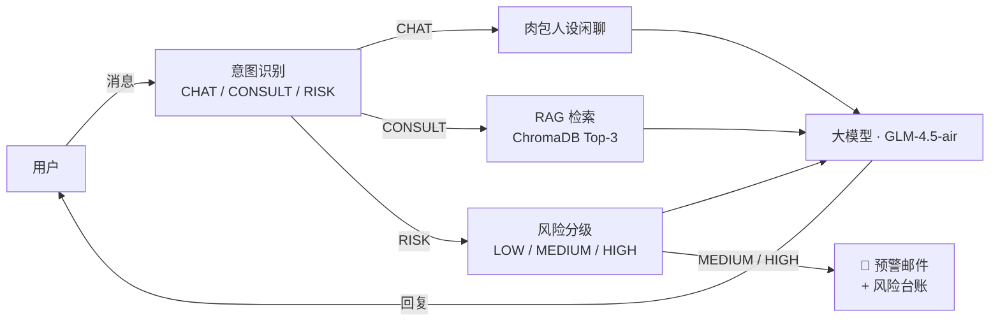

# PsycheLink 🧠

[](https://github.com/CharlsOliver-kws/Psychelink/actions/workflows/ci.yml)
[](LICENSE)
[](https://spring.io/projects/spring-boot)
[](https://openjdk.org/)

中文 | **[English](README.md)**

PsycheLink 是一个基于 **Spring Boot 3 + Spring AI** 构建的心理健康 AI 陪伴助手。表面上它是一个友好的聊天应用（「肉包的聊天小站」）；实际上，每条消息都会经过意图识别、基于 ChromaDB 心理知识库的 RAG 检索，以及**风险自动检测与邮件预警** —— 构成从「识别」到「干预」的完整闭环。

> ⚠️ **免责声明**：PsycheLink 是一个技术演示项目，**不是**医疗设备，也**不能**替代专业心理帮助。如果你或你身边的人正处于危机中，请立即联系当地紧急服务或心理援助热线。

## 工作原理



- **CHAT** — 以「肉包」人设进行日常闲聊
- **CONSULT** — 用户问题向量化后与 ChromaDB 中 101 条专业心理问答匹配，检索结果作为上下文生成有依据的回答
- **RISK** — 对消息进行严重程度分级；MEDIUM/HIGH 会异步触发预警邮件与风险台账记录，同时用户收到专业干预回应

## 功能特性

- ✅ 三分类意图识别（CHAT / CONSULT / RISK）：关键词初筛 + LLM 分类
- ✅ RAG 管线：向量化 → ChromaDB 相似检索 → 知识增强生成
- ✅ 风险分级 + 自动预警邮件（Spring Mail + SMTP）
- ✅ OpenTelemetry 全链路 Trace：每次对话产生 `prompt_assembly`、`rag`、`mcp_email` 等 Span（OTel Java Agent）
- ✅ 兼容任意 OpenAI 协议端点（默认智谱 GLM）

## 快速开始

**环境要求**：JDK 17、Docker。

```bash
# 1. 启动 ChromaDB
docker compose up -d chromadb

# 2. 配置密钥
cp .env.example .env    # 填入 ZHIPU_API_KEY、MAIL_*、ALERT_RECIPIENT

# 3. 运行（先加载环境变量，Linux/macOS: set -a; source .env; set +a）
./mvnw spring-boot:run
```

打开 http://localhost:8088，知识库会在首次启动时自动导入。

<details>
<summary>Windows（PowerShell）</summary>

```powershell
docker compose up -d chromadb
Copy-Item .env.example .env   # 编辑填入密钥
$env:ZHIPU_API_KEY="..."; $env:MAIL_USERNAME="..."; $env:MAIL_PASSWORD="..."; $env:ALERT_RECIPIENT="..."
.\mvnw.cmd spring-boot:run
```
</details>

## 配置项

所有密钥均来自环境变量（模板见 [.env.example](.env.example)）：

| 变量 | 必填 | 说明 |
|---|---|---|
| `ZHIPU_API_KEY` | ✅ | 大模型服务商 API Key（默认智谱） |
| `LLM_BASE_URL` | – | 任意 OpenAI 兼容端点 |
| `LLM_MODEL` | – | 默认 `glm-4.5-air` |
| `MAIL_USERNAME` / `MAIL_PASSWORD` | – | SMTP 发件邮箱（QQ 邮箱为授权码，非登录密码） |
| `ALERT_RECIPIENT` | – | 风险预警接收邮箱 |
| `CHROMA_URL` | – | 默认 `http://localhost:8000` |

## 项目结构

```
src/main/java/com/psychic/agent/
├── config/          # WebClient、Security、CORS、数据初始化
├── controller/      # REST 接口（对话、注册）
├── service/         # ChatService（编排）、PsychologicalService（意图/风险）、
│                    # KnowledgeBaseService + EmbeddingService + ChromaService（RAG 管线）、
│                    # McpEmailService（预警邮件）、McpExcelService（风险台账）
├── entity/          # JPA 实体
└── repository/      # Spring Data JPA
```

更多细节：[docs/architecture.md](docs/architecture.md) · 可观测性指南：[docs/observability.md](docs/observability.md)

## Roadmap

- [ ] SSE 流式响应
- [ ] JWT 认证 + RBAC 权限
- [ ] MCP（Model Context Protocol）工具接入
- [ ] 多模型动态路由（敏感处理走本地 Ollama，通用问答走云端 API）

## 参与贡献

欢迎提交 Issue 和 PR，见 [CONTRIBUTING.md](CONTRIBUTING.md)。

## 开源协议

[MIT](LICENSE)
