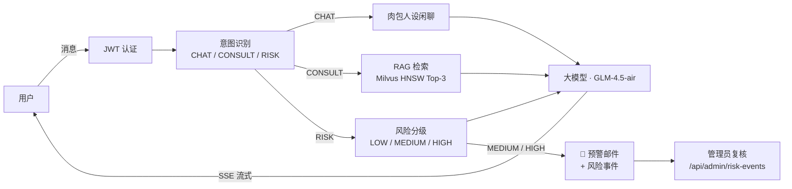

# PsycheLink 🧠

[](https://github.com/CharlsOliver-kws/Psychelink/actions/workflows/ci.yml)
[](LICENSE)
[](https://spring.io/projects/spring-boot)
[](https://spring.io/projects/spring-ai)
[](https://openjdk.org/)

中文 | **[English](README.md)**

PsycheLink 是一个基于 **Spring Boot 3 + Spring AI** 构建的心理健康 AI 陪伴助手。表面上它是一个友好的聊天应用（「肉包的聊天小站」）；实际上，每条消息都会经过意图识别、基于 **Milvus**（HNSW 索引）心理知识库的 RAG 检索、**SSE 流式**响应，以及**风险自动检测 + 邮件预警 + 人工复核** —— 构成从「识别」到「干预」的完整闭环。

> ⚠️ **免责声明**：PsycheLink 是一个技术演示项目，**不是**医疗设备，也**不能**替代专业心理帮助。如果你或你身边的人正处于危机中，请立即联系当地紧急服务或心理援助热线。

## 工作原理



- **CHAT** — 以「肉包」人设进行日常闲聊
- **CONSULT** — 用户问题向量化后与 Milvus 中 101 条专业心理问答做 HNSW 相似检索（IP 度量），检索结果作为上下文生成有依据的回答
- **RISK** — 对消息进行严重程度分级；MEDIUM/HIGH 会异步触发预警邮件（以 MCP 工具形式封装）、持久化风险事件并写入 Excel 台账，同时用户收到专业干预回应；管理员通过复核接口处理事件，完成闭环

## 功能特性

- ✅ **流式对话** — `Flux<String>` SSE 接口（`/api/chat/stream`），首个 Token 到达即开始渲染
- ✅ **JWT 认证 + RBAC** — 无状态令牌，`ROLE_USER` / `ROLE_ADMIN` 权限隔离；用户只能查看自己的历史记录；管理端接口（风险事件、复核、MCP 端点）仅管理员可访问
- ✅ **RAG 管线** — 向量化 → Milvus HNSW 相似检索 → 知识增强生成；Milvus 不可用时优雅降级
- ✅ **风险管理闭环** — 识别 → 预警邮件（MCP 工具）→ 风险事件落库 → 人工复核接口
- ✅ **MCP Server** — 邮件与风险记录工具通过 Model Context Protocol（`spring-ai-starter-mcp-server-webmvc`）暴露给外部 AI 客户端
- ✅ **LoRA 微调管线** — `training/` 提供数据准备（Pandas 清洗 / 去重 / 类别均衡）与监督微调脚本，评估输出混淆矩阵并重点检查风险漏报率
- ✅ 三分类意图识别：关键词初筛 + LLM 分类 + 规则兜底（RISK 消息绝不会被静默误判为 CHAT）
- ✅ OpenTelemetry 全链路 Trace（OTel Java Agent）
- ✅ 兼容任意 OpenAI 协议端点（默认智谱 GLM）

## 快速开始

**环境要求**：JDK 17、Docker。

```bash
# 1. 启动 Milvus（etcd + MinIO + Milvus）
docker compose up -d

# 2. 配置密钥
cp .env.example .env    # 填入 ZHIPU_API_KEY、MAIL_*、ALERT_RECIPIENT

# 3. 运行（先加载环境变量，Linux/macOS: set -a; source .env; set +a）
./mvnw spring-boot:run
```

打开 http://localhost:8088，注册账号即可开始对话。知识库首次启动时自动导入；管理员账号在启动时引导创建（在 `.env` 中设置 `ADMIN_PASSWORD`，或查看日志中的随机密码）。

<details>
<summary>Windows（PowerShell）</summary>

```powershell
docker compose up -d
Copy-Item .env.example .env   # 编辑填入密钥
$env:ZHIPU_API_KEY="..."; $env:MAIL_USERNAME="..."; $env:MAIL_PASSWORD="..."; $env:ALERT_RECIPIENT="..."; $env:ADMIN_PASSWORD="..."
.\mvnw.cmd spring-boot:run
```
</details>

<details>
<summary>不启动 Milvus / 不配置 LLM Key 也能跑</summary>

应用照常启动 —— RAG 降级为空上下文，LLM 调用失败时回退关键词规则回复。适合本地开发调试。
</details>

## 配置项

所有密钥均来自环境变量（模板见 [.env.example](.env.example)）：

| 变量 | 必填 | 说明 |
|---|---|---|
| `ZHIPU_API_KEY` | ✅ | 大模型服务商 API Key（默认智谱） |
| `LLM_BASE_URL` | – | 任意 OpenAI 兼容端点 |
| `LLM_MODEL` | – | 默认 `glm-4.5-air` |
| `MILVUS_HOST` / `MILVUS_PORT` | – | 默认 `localhost:19530` |
| `JWT_SECRET` | – | 生产环境强烈建议设置（≥ 32 字节强随机串） |
| `ADMIN_USERNAME` / `ADMIN_PASSWORD` | – | 管理员引导账号；未设密码则生成随机密码打印到日志 |
| `MAIL_USERNAME` / `MAIL_PASSWORD` | – | SMTP 发件邮箱（QQ 邮箱为授权码，非登录密码） |
| `ALERT_RECIPIENT` | – | 风险预警接收邮箱 |

## API 一览

| 接口 | 方法 | 权限 | 说明 |
|---|---|---|---|
| `/api/auth/register` | POST | – | 注册（默认 `ROLE_USER`），返回 JWT |
| `/api/auth/login` | POST | – | 登录，返回 JWT |
| `/api/chat/stream` | POST | USER | SSE 流式对话 |
| `/api/chat/history` | GET | USER | 本人历史记录（数据级隔离） |
| `/api/admin/risk-events` | GET | ADMIN | 风险事件列表，可按复核状态过滤 |
| `/api/admin/risk-events/{id}/review` | PUT | ADMIN | 人工复核：确认 + 处理意见 |
| `/sse`（MCP 端点） | – | ADMIN | MCP 工具服务（邮件 / 风险记录） |

## 项目结构

```
├── src/main/java/com/psychic/agent/
│   ├── config/          # ChatClient、Security（JWT + RBAC）、MCP Server、数据初始化
│   ├── controller/      # REST 接口（认证、对话、管理端）
│   ├── security/        # JWT 签发/解析 + 认证过滤器
│   ├── dto/             # 请求/响应记录
│   ├── service/         # ChatService（流式编排）、PsychologicalService（意图/风险）、
│   │                    # KnowledgeBaseService + EmbeddingService + MilvusVectorStore（RAG 管线）、
│   │                    # McpEmailService（预警工具）、McpExcelService（台账工具）、
│   │                    # RiskEventService、ChatHistoryService
│   ├── entity/          # JPA 实体（User、ChatMessage、RiskEvent）
│   └── repository/      # Spring Data JPA
├── training/            # 数据准备 + LoRA 微调 + 评估（Python）
└── docs/                # 架构与可观测性文档
```

更多细节：[docs/architecture.md](docs/architecture.md) · 可观测性指南：[docs/observability.md](docs/observability.md) · 微调管线：[training/README.md](training/README.md)

## Roadmap

- [ ] 多模型动态路由（敏感处理走本地 Ollama，通用问答走云端 API）
- [ ] 管理端 Web 控制台（风险事件复核界面）
- [ ] 知识库管理接口（增 / 删 / 改）

## 参与贡献

欢迎提交 Issue 和 PR，见 [CONTRIBUTING.md](CONTRIBUTING.md)。

## 开源协议

[MIT](LICENSE)
