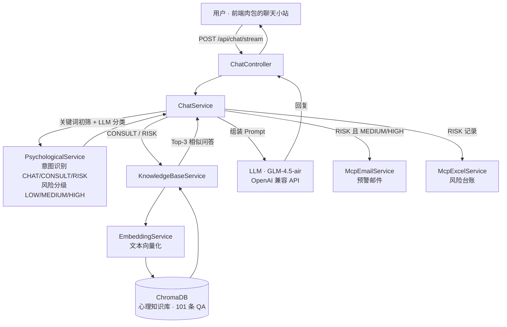

# PsycheLink 架构说明

## 总体流程



## 意图三分支

| 意图 | 处理路径 |
|---|---|
| **CHAT** 日常闲聊 | 肉包人设 Prompt → LLM 直接回答 |
| **CONSULT** 心理咨询 | 用户问题向量化 → ChromaDB Top-3 检索 → 知识作为上下文 → LLM 生成回答 |
| **RISK** 危险意图 | 风险分级（LOW/MEDIUM/HIGH）→ 检索专业干预知识 → 生成干预回应 → MEDIUM/HIGH 异步触发预警邮件 + 风险台账记录 |

## 分层结构

```
src/main/java/com/psychic/agent/
├── config/        # WebClient、Security、CORS、数据初始化
├── controller/    # ChatController（对话）、AuthController（注册）
├── service/       # ChatService（编排）、PsychologicalService（意图/风险）、
│                  # KnowledgeBaseService + EmbeddingService + ChromaService（RAG 管线）、
│                  # McpEmailService（预警邮件）、McpExcelService（风险台账）
├── entity/        # JPA 实体
├── repository/    # Spring Data JPA
└── security/      # UserDetailsService
```

## 技术选型

| 组件 | 选型 | 说明 |
|---|---|---|
| 框架 | Spring Boot 3.4.3 | Web + WebFlux（WebClient 用于 LLM 调用） |
| LLM | GLM-4.5-air | 智谱 OpenAI 兼容 API，可换任意兼容端点 |
| 向量库 | ChromaDB | 心理知识库存储与相似检索 |
| Embedding | embedding-2 | 智谱向量化模型 |
| 数据库 | H2（默认，MySQL 模式） | 零依赖启动，可切换 MySQL |
| 邮件 | Spring Mail + QQ SMTP | 风险预警 |
| 可观测 | OpenTelemetry | Agent 自动采集 + @WithSpan 手动埋点，详见 [observability.md](observability.md) |

## 已知局限（诚实声明）

- 登录接口为演示用简化实现，未接 JWT / 完整 RBAC（见 Roadmap）
- 对话接口当前为一次性响应，SSE 流式在 Roadmap 中
- `Mcp*Service` 命名源于设计初期对 MCP 协议的规划，当前实现为普通 Spring 服务，尚未接入 MCP 协议（见 Roadmap）
